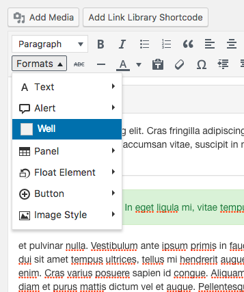

# bootstrap-tinymce

Adds Bootstrap format pull-down menu to WP TinyMCE editor. You can copy the contents of editor.php to your child theme's functions.php file, or include it from the same.

Then, you can place the editor-style.css in your child theme folder, and you'll be able to see the changes live in the TinyMCE editor. 

